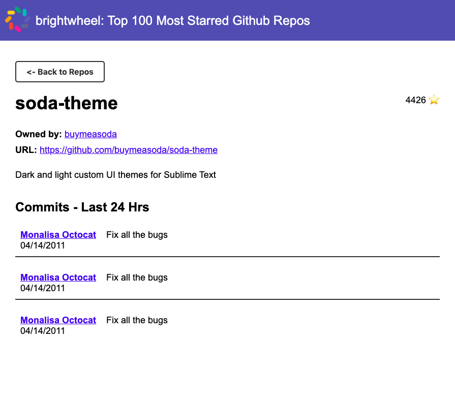

# Brightwheel Coding Exercise
#### Submitted by: Jesus Garcia

## How to Run

Run the app by running the following in the directory:

```bash
yarn start
```

Open [http://localhost:3000](http://localhost:3000) to view it in the browser.

To launch the test runner in the interactive watch mode, run the following in the directory:

```bash
yarn test
```

## Notes
### Commits endpoint returning 404
I wasn't able to get the commits endpoint working properly in time. It returns a 404, which the Github documentation mentions is the status code for a call with failed authentication. This would be the main area of focus if I had more time as it's part of the core functionality of the app. 

### Process
I started out by drawing up a quick wireframe of how I wanted the app to look like to see what components I needed to create. After that, I set up the app using create-react-app and cleaned up the directory structure to best work for me.

I then created the files for the components I needed as well as the corresponding stylesheet files (using SASS). I had also initially created a separate directory for the APIs, but had to move the fetch calls within the components since I was running into issues with catching errors.

I then built the larger components and styles without the API calls, using mock data to format how the data will look like without worrying about the APIs for now. 

It took me some time to figure out how to use the API to get the repositories list and longer to try to figure out how the commits endpoint works and trying to solve the authentication issue. The screenshot below shows how the page looks like when the endpoint works:



I also added an error and loading state to indicate to the user when the page is loading and when the calls fail and what to do. The messages right now are very generic, but the message will depend on how we want users to handle the errors (e.g. contact customer support).

### If I had more time...
I would focus first on fixing the issue described above with the commits endpoint call.

I would dig further into making sure our users get the best experience out of our app. This includes making our app more accessible (from making sure the color contrast meets WCAG AA or AAA guidelines to adding `sr-only` lablels for users that use screenreaders) and adding a few polishing touches such as animating the loading state with a loading icon or animating the transitions when you click to see more for a repository.

I would also add testing around the flow of th app to make sure everything is in place. I don't know if there are better ways to test out a feature where most of the logic is in the components and their renders, but I would add some integration tests around the initial load of the page as well as the details page with the commit list. 

Because we are working with 3rd-party APIs, we should be careful around how we test the feature. We could add some sort of ping for us to check that the APIs are up or when they're down, but depending on our workflow and what issues we want our tests to catch, we'll probably not want our tests to fail due to external factors.

### Miscellaneous
The commit history in the repo spans across ~20 hours. This is because I unfortunately couldn't find a good chunk of time to sit down and work on this all at once, so I started it for ~20 minutes the day before and ended up finishing it the morning after.
